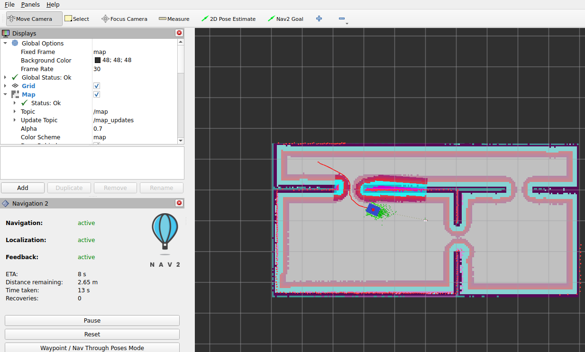
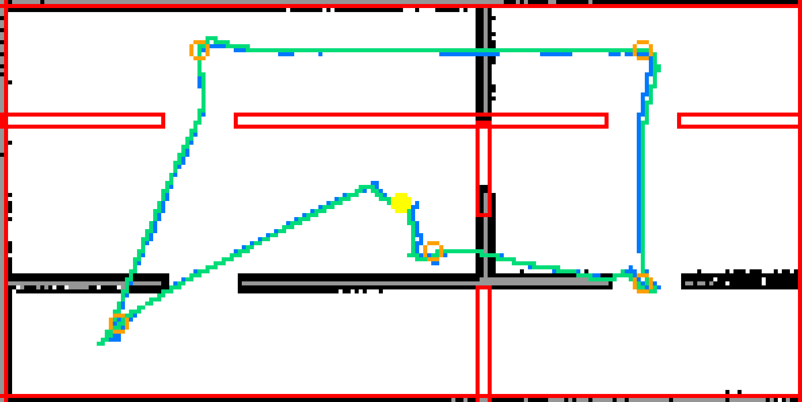

# Nav2 导航（AMCL 定位 + 全局规划 + MPPI 控制）

## 怎么跑

```bash
# 一条命令：Gazebo + map_server + AMCL + Nav2 全部节点 + RViz
ros2 launch my_robot_description nav.launch.py

# 等 RViz 起来以后，用工具栏的 "Nav2 Goal" 点一个目标（点一下 + 拖一下定朝向）
```

常用变体：

```bash
# Gazebo 已经在别的终端跑着，只起 Nav2 + RViz
ros2 launch my_robot_description nav.launch.py sim:=false

# 不开 RViz（省内存 / 无头验证）
ros2 launch my_robot_description nav.launch.py rviz:=false

# 不定位，改成边建图边导航（用 slam_toolbox 顶掉 AMCL）
ros2 launch my_robot_description nav.launch.py slam:=true

# 换地图 / 换 world / 换参数文件
ros2 launch my_robot_description nav.launch.py map:=/abs/path/other.yaml
ros2 launch my_robot_description nav.launch.py world:=empty.sdf
ros2 launch my_robot_description nav.launch.py params_file:=/abs/path/nav2_params.yaml
```

用命令行发目标的办法（脚本化验证时用）：

```bash
ros2 action send_goal /navigate_to_pose nav2_msgs/action/NavigateToPose \
  "{pose: {header: {frame_id: map}, pose: {position: {x: 3.0, y: 1.9}, orientation: {w: 1.0}}}}"
```

## 实测结果

`worlds/rooms.sdf` + `maps/rooms.yaml`，串起 6 个目标点，路线故意**穿过全部三个门**、
跨两个房间和走廊。评判用的是 Gazebo 真值位姿（`/world/default/pose/info`），不是 RViz 上
看着像不像。

### 逐目标结果

| # | 目标 | 目标点 (m) | 终点真值 (m) | 到目标距离 | 耗时 |
|---|---|---|---|---|---|
| 1 | 房间 A 西南角 | (−3.50, −1.50) | (−3.695, −1.737) | **30.7 cm** | 24 s |
| 2 | 穿门 A 进走廊 | (−2.50, +1.90) | (−2.481, +1.981) | 8.3 cm | 19 s |
| 3 | 走廊东端 | (+3.00, +1.90) | (+2.895, +1.882) | 10.6 cm | 17 s |
| 4 | 穿门 B 进房间 B | (+3.00, −1.00) | (+3.146, −1.115) | 18.6 cm | 16 s |
| 5 | 穿门 AB 回房间 A | (+0.40, −0.60) | (+0.237, −0.702) | 19.2 cm | 22 s |
| 6 | 回到起点 | (0.00, 0.00) | (+0.083, −0.026) | 8.7 cm | 11 s |

**6/6 成功，重复跑两遍都一样。** 终点误差均值 16.0 cm、最大 30.7 cm。

`general_goal_checker.xy_goal_tolerance` 设的是 0.20 m，也就是说 Nav2 认为"到了"的时候，
按 **AMCL 的估计**算误差确实在 20 cm 以内；表里的"到目标距离"是按**真值**算的，
两者之差就是定位误差（见下一节）。目标 1 的 30.7 cm 里有一大半是 AMCL 那一下偏了 13.8 cm。

### 定位精度（`/amcl_pose` 对同刻真值，212 个样本）

| 指标 | 数值 |
|---|---|
| 位置误差 均值 / 中位 / 95 分位 / 最大 | **6.48 / 5.91 / 12.71 / 15.75 cm** |
| x 方向 偏置 / 标准差 | +3.48 / 5.76 cm |
| y 方向 偏置 / 标准差 | +1.29 / 2.65 cm |
| 航向误差 偏置 / 标准差 / 绝对值均值 | −0.44° / 1.81° / **1.43°** |
| AMCL 自报 1σ | 位置 15.0 / 8.7 cm，航向 7.44° |

两条结论：

1. **AMCL 报的协方差偏保守**（自报 1σ = 15 cm，实测均值 6.5 cm）。做融合/判断"能不能信"
   的时候按这个来会过于谨慎。
2. **误差里一半是固定偏置**：偏置模长 3.72 cm，占平均误差的 57%。
   这不是地图的问题 —— 直接量过：地图上 1671 个占用格到最近真实墙面的距离
   均值 **1.50 cm**、中位 0、最大 7.91 cm，地图整体相对 world 只平移了
   dx −0.47 / dy −0.94 cm。剩下的 3 cm 量级偏置来自栅格地图本身的半格量化
   （似然场以**栅格中心**为参考，而雷达测的是**墙面**，天然差半格 2.5 cm）。
   这是所有栅格地图定位都有的，不是本工程的缺陷。

> 为什么不直接用 `tf2_echo map base_link` 量？因为那两条链的发布节奏不一样：
> `map->odom` 只在滤波更新时刷新、时间戳还被往后外推 `transform_tolerance` 秒，
> `odom->base_link` 是 DiffDrive 50 Hz 的。拼出来的位姿自带一份滞后。
> 同一批数据两种量法差 0.9 cm（7.37 vs 6.48），所以文档里报的是同刻比对的结果。

### 有没有蹭墙

真值轨迹到最近墙面的距离：**最小 35.3 cm**，全程 116869 个采样点里没有一个小于 15 cm。

车体外接圆半径 27.3 cm，`inflation_radius` 设的是 0.35 m —— 最小值 35.3 cm 正好说明
膨胀层按设计把车挡在了 0.35 m 外。0.9 m 宽的门能过去（需要 0.37 m 净宽），
全程碰撞次数 0、恢复行为触发次数 0。

## RViz 里长这样



> 紫/粉是全局代价地图的膨胀层，红点是实时 `/scan`，红色曲线是 `/plan`（全局路径），
> 蓝框是 `footprint`，绿点是 AMCL 粒子云（收得很紧 = 定位收敛）。
> 左侧 Nav2 面板显示 Navigation / Localization / Feedback 都是 active，
> 这一帧还剩 2.65 m、零恢复行为。

## 真值轨迹 vs AMCL 估计



> 底图是黑=地图占用格，红框=真实墙面，绿线=Gazebo 真值轨迹，蓝线=AMCL 估计轨迹，
> 橙圈=目标点，黄点=起点。两条线几乎完全重合（差 6.5 cm 量级），
> 三个门都穿过去了，没有出现"估计穿墙"或"真值贴墙"的错位。

## ★ skid-steer 的"有效轮距"标定（这一步最要紧）

### 问题

`gz-sim-diff-drive-system` 用几何轮距 b = 0.34 m 做两件事：

```
指令侧：  Δv = ω_cmd · b          （转成左右轮速差）
里程计侧：ω_odom = Δv / b        （从轮速差反算转角）
```

但四轮 skid-steer 原地转时每个轮子都在横向刮擦，车体**真实**转角小于轮子
"应该"转过的角度：

```
ω_true = Δv / b_eff ，  b_eff > b
```

于是一个倍率同时污染了两件事：

| | 标定前（实测） | 含义 |
|---|---|---|
| `ω_odom / ω_true` | **1.36** | 里程计报的转角比真实大 36% |
| `ω_true / ω_cmd` | **0.73** | 命令转 1 圈，实际只转 0.73 圈 |

### 测法

`cmd_vel` 下固定角速度转一段固定时间，用 Gazebo 真值位姿累加**未缠绕**的转角增量
（不能取末减初，±180° 有歧义），并且按**仿真时间**计（实时率不是 1.0）。

倍率很稳（1.355~1.364），所以取 **1.36**。标定后 `odom/真值` 落到 1.00~1.04。

> **完整的五个工况数据表（含弧线工况）不在这里，见
> [`real_robot_params.md` 第二节](real_robot_params.md)。** 那里也是实车标定步骤的正式出处，
> 本节只讲"为什么需要这个系数"。

### 解法

把插件里的 `wheel_separation` 换成有效轮距 `b_eff = b · scale`：

```
指令侧：  Δv = ω_cmd · b_eff  →  ω_true = ω_cmd          ✅
里程计侧：ω_odom = Δv / b_eff = ω_cmd = ω_true           ✅
```

一个系数同时修好控制和里程计，而且**不用动物理**：轮子该刮还是刮，
只是"上报"的口径对了。这也是实车上的标准做法。

参数在 `urdf/my_robot.urdf.xacro` 的 property 块里：

```xml
<xacro:property name="wheel_separation_scale" value="1.36"/>
```

**⚠ 1.36 是仿真值，实车必须重测。** 步骤见
[`real_robot_params.md` 第二节](real_robot_params.md)。

## 配置里几处必须跟着实车改的地方

`config/nav2_params.yaml` 是 `nav2_bringup` 上游默认值的派生版，改过的地方都标了 `★`。
最要紧的四类：

| 参数 | 值 | 为什么不能照抄上游 |
|---|---|---|
| `amcl.base_frame_id` | `base_link` | 上游是 `base_footprint`。我们没有这个 link，AMCL 会一直等一个不存在的 TF，然后**静默地**不发 `map->odom` |
| `footprint` | `[[-0.20,-0.185],[0.20,-0.185],[0.20,0.185],[-0.20,0.185]]` | 上游 `robot_radius: 0.22`。我们车体外接圆 0.273、而且**轮子比车体宽 3.5 cm**，用 0.22 的圆会漏碰 |
| `inflation_radius` | `0.35` | 上游 0.70。门只有 0.9 m 宽，0.70 的膨胀会让门口整段变成高代价区 |
| `collision_monitor.scan.min_height` | `0.0` | 上游 0.15，而我们的雷达装在 `base_link` 上方 0.12 m —— 扫描点在 base 系里 z≈0.12，会被"太矮"全部过滤掉，紧急制动形同虚设 |

另外 `vx_max / wz_max / ax_max / az_max` 和 `velocity_smoother` 的三组上下限，
全部对齐 xacro 里的 `max_*_vel / max_*_acc`。**两边不一致会互相打架**：
插件会在加速度上再截一次，表现为"控制器以为发出去了但车没跟上"。

`collision_monitor.base_frame_id` 同样要从 `base_footprint` 改成 `base_link`。

### cmd_vel 链路（Jazzy 的 `navigation_launch.py` 已经 remap 好了）

```
controller_server --cmd_vel_nav--> velocity_smoother
    --cmd_vel_smoothed--> collision_monitor --/cmd_vel--> ros_gz_bridge
    --> gz DiffDrive
```

注意 `collision_monitor` 是**最后一道闸**：它不 active，`/cmd_vel` 上就一个消息都没有，
车完全不动，而且不会有报错。排查"车不动"时先看这里。

## ⚠️ 踩过的坑

### 1. 给 `nav2_bringup` 传小写布尔值会让整个 launch 崩掉

```
[ERROR] [launch]: Caught exception in launch (see debug for traceback):
    name 'false' is not defined
```

`nav2_bringup` 里有几处用 `PythonExpression` 拼**裸布尔字面量**：

```python
# bringup_launch.py
condition=IfCondition(PythonExpression([slam, ' and ', use_localization]))
# navigation_launch.py / localization_launch.py
condition=IfCondition(PythonExpression(['not ', use_composition]))
```

等价于 `eval("false and true")`。Python 只认 `False`/`True`，所以传小写的
`slam:=false`（launch 的常规写法）直接崩。上游默认值恰好是首字母大写的
`'False'`/`'True'`，所以照抄不会炸，自己传就炸。

`nav.launch.py` 里用 `_pybool()` 统一转成大写的 Python 字面量再往下传。

### 2. `IncludeLaunchDescription` 的 `launch_arguments` 会污染外层上下文

`nav.launch.py` 需要让 `gazebo_sim.launch.py` 别启动它自己的 RViz，但**不能**用
`launch_arguments={'rviz': 'false'}` —— 那会把 `rviz` 推进**外层** launch 上下文，
于是本文件下面那个 RViz 节点的 `IfCondition('rviz')` 也变成 false，
RViz 静默地不启动（日志里一行都没有）。

必须用 `GroupAction(launch_configurations={'rviz': 'false'})` 把它限制在子作用域里。

### 3. 上一次崩溃留下的 `component_container` 会活下来

Nav2 用组件容器（`use_composition:=true`，默认）把所有节点装进一个进程。
launch 中途抛异常时，**已经起来的容器不会跟着死**。残留的容器里可能还有
`map_server` / `amcl` 的实例，于是 `/map`、`map->odom` 被发布两遍，
或者 `collision_monitor` 有两个在抢 `/cmd_vel`。

这和 SLAM 阶段踩过的"重复 `parameter_bridge`"是同一类问题（见 `slam.md`）。
所以：**每次重新 launch 之前先确认干净**。Linux 的 `comm` 只有 15 字符，
容器进程名实际是 `component_conta`，排查时别用 `pkill -x component_container_isolated`。

### 4. AMCL 观测模型照抄上游会"收不紧"

上游 `z_hit: 0.5 / z_rand: 0.5` 意味着一半观测被当成噪声，似然面非常平；
`sigma_hit: 0.2` 又让偏 10 cm 的粒子只被罚掉 12% 的似然。合起来的效果是
粒子云收不紧、定位抖动 ±8 cm。

改成 `z_hit: 0.8 / z_rand: 0.2`、`sigma_hit: 0.1`、`laser_likelihood_max_dist: 1.0`、
`max_beams: 120`（360 束里取 1/3）后，同一路线的平均定位误差
（TF 口径，未标定 AMCL 参数 vs 标定后）：**9.79 cm → 7.37 cm**。

`update_min_a/d` 从 0.2/0.25 收到 0.15/0.15：这台车 0.5 m/s、1.5 rad/s，
按上游阈值最坏情况下 0.5 s 才做一次滤波更新，期间全靠里程计外推。

## 边建图边导航（`slam:=true`）

```bash
ros2 launch my_robot_description nav.launch.py slam:=true
```

`slam_toolbox` 顶替 AMCL + map_server，提供 `/map` 和 `map->odom`，Nav2 在
"正在生长的地图"上规划和控制。此时 `map:=` 被忽略，SLAM 参数固定用
`config/slam_toolbox.yaml`。

用途：**换场地时不用"先建图、再导航"两步**。直接点目标，车一边走一边把地图
建出来，走完存图即可。

### 为什么不走 `nav2_bringup` 自带的 slam 分支

`nav.launch.py` 传给 `nav2_bringup` 的是 `slam=False + use_localization=False`，
slam_toolbox 由本文件自己 include（`slam_toolbox/launch/online_async_launch.py`）。

原因在 `nav2_bringup/slam_launch.py`：

```python
has_slam_toolbox_params = HasNodeParams(params_file, 'slam_toolbox')
... launch_arguments={'slam_params_file': params_file}
    condition=IfCondition(has_slam_toolbox_params)
```

**只有当 `params_file` 里存在 `slam_toolbox:` 这一节时，它才会把参数传下去。**
我们的 `config/nav2_params.yaml` 是纯 Nav2 参数、没有那一节，于是它会退回上游
默认的 `mapper_params_online_sync.yaml`：

| 上游默认值 | 后果 |
|---|---|
| `base_frame: base_footprint` | 我们没有这个 link → 拿不到雷达 TF → `/map`、`map->odom` **一个都不发** |
| `check_min_dist_and_heading_precisely: false` | 原地旋转的扫描全部被丢弃（见 `slam.md`） |
| `loop_search_maximum_distance: 3.0` | 假回环，地图上出现两份房间（见 `slam.md`） |

失败表现极具迷惑性：Gazebo、Nav2、日志全部正常，**只有 RViz 里永远是一张空地图**，
看起来像"SLAM + Nav2 这条路走不通"。

自己 include 还有好处：用 `online_async`（后台线程处理扫描，边走边建图不容易丢帧，
`slam.launch.py` 当初也是特意选的它）。

> **关于启动顺序**：一开始我以为要让 SLAM 先起、Nav2 晚一点起，否则
> `global_costmap` 的 `global_frame: map` 在 activate 时找不到 TF 会激活失败。
> 后来做了对照实验，**结论是不需要**。实测时间线（`sim:=false slam:=true`）：
>
> ```
> 882.11  slam_toolbox 进程启动
> 882.40  slam_toolbox activating
> 883.10  Nav2 组件容器启动
> 883.39 ~ 883.65  各节点 load 完
> ~893    global_costmap 才 activate
> ```
>
> `slam_toolbox` 是普通节点、起来就能处理扫描；而 Nav2 是组件容器 + 逐个
> lifecycle 转换，**光激活就要约 10 秒**，天然落后十几秒。把延迟硬去掉重跑，
> `global_costmap` 依然一次激活成功，日志里一条 `Timed out waiting for transform`
> 都没有，两个穿门目标也都 SUCCEEDED。所以 `nav.launch.py` 里**没有**这个延迟
> （只有 `sim:=true` 时那个等机器人 spawn 的 15 s）。

### 实测（`worlds/rooms.sdf`，4 个目标串起三个门）

| # | 目标 (m) | 终点（SLAM 估计） | 到目标距离 | 结果 |
|---|---|---|---|---|
| 1 | (−2.5, 0.6) | (−2.578, 0.687) | 11.7 cm | SUCCEEDED |
| 2 | (−2.5, 1.9) 穿门 A | (−2.366, 1.865) | 13.9 cm | SUCCEEDED |
| 3 | (2.5, 1.9) 走廊东端 | (2.399, 1.885) | 10.2 cm | SUCCEEDED |
| 4 | (3.0, 0.3) 穿门 B | (3.055, 0.215) | 10.1 cm | SUCCEEDED |

**4/4 成功**，全部落在 `xy_goal_tolerance: 0.20` 内。所有节点（含
`global_costmap`）lifecycle 一次激活成功，启动日志无 ERROR / WARN。

走完存图后与解析几何逐格比对：

| 指标 | 数值 |
|---|---|
| 尺寸 | 199 × 100 格 @ 0.05 m = 9.95 × 5.00 m |
| 占用 / 空闲 / 未知 | 1549 (7.8%) / 17806 (89.5%) / 545 (2.7%) |
| 占用格到最近真实墙面 均值 / 最大 | **1.03 / 5.90 cm** |
| 占用格 ≤ 5 cm / ≤ 10 cm | 99.42% / **100%** |
| 幻影墙（整块离墙 > 15 cm） | **0 块** |
| 可见墙面覆盖率 | **86.02%** |
| 三个门洞占用率 | 11.1% / 11.1% / 9.3%（同一方法量真实墙段是 43.3%） |
| 相对 world 的整体偏移 | dx −1.0 / dy −3.0 cm |

三张地图用**同一套脚本**量的对比（口径一致才可比）：

| 地图 | 占用格到墙均值 | ≤ 5 cm 占比 | 幻影墙 | 墙面覆盖率 |
|---|---|---|---|---|
| 本节的 slam:=true（边导航边建） | **1.03 cm** | 99.42% | 0 | **86.02%** |
| 手动遥控建的那张 | 1.12 cm | 99.95% | 0 | 87.05% |
| `maps/rooms.yaml`（早期脚本自动建） | 1.50 cm | 85.70% | 0 | 78.13% |

结论：**一边被 Nav2 拉着跑、一边建出来的地图，质量和不动的建图流程是一个量级**
（占用格精度还比早期那张更好）。这条路可以放心用来换场地。

## 能过 ≠ 好过：膨胀半径与通道宽度的关系

带障碍物的世界 `worlds/rooms_obstacles.sdf` 里量到的一件事，比上面那条更普遍：

**规划器看的是代价图，不是几何留白。** 障碍物周围按 `inflation_radius: 0.35`
铺一圈代价，两个障碍物之间哪怕物理上留了 0.7 m，两边各铺 0.35 m 之后中间也
只剩一条极窄的低代价缝。

用 `scripts/cost_slice.py` 量 `rooms_obstacles.sdf` 走廊里那条通道
（障碍物 `obs_corridor` 占 y∈[1.35,1.75]，北墙内表面 y=2.425，**物理上留
0.675 m**，车宽 0.37 m，看着很宽裕）：

```
   y      x=-0.30 ... x=+0.25        代价
  2.45    100 100 100 ...            北墙致命
  2.30     99  99  99 ...            内切膨胀
  2.25     96  96  96 ...
  2.20     82  82  82 ...
  2.15     71  71  71 ...   ← 最便宜的一格也就这样
  2.10     71  71  71 ...
  2.05     82  82  82 ...
  2.00     96  96  96 ...
  1.95     99  99  99 ...            内切膨胀
  1.80    100 100 100 ...            障碍物致命
```

**整条通道没有一格是自由空间（0）。** 这张表是某一时刻的快照，具体数字会在
61 ~ 99 之间浮动（膨胀层 + 障碍物层当时合成出什么就是什么），**但"没有 0"
这件事不变** —— 因为它是几何决定的：

```
通道 0.675 m  <  2 × inflation_radius = 2 × 0.35 = 0.70 m
```

**两侧的膨胀场本来就是重叠的**，中间不可能留出自由空间。机器人是靠"压在
内切膨胀区的边界上"擦过去的，没有任何余量。

后果（实测）：在 `rooms_obstacles.sdf` 里，斜墙 `obs_roomB_slant` 东端与东墙
之间的通道物理上留 0.726 m，代价图里最便宜也是 71、并且**一半格子是 99**。
机器人偶尔会选这条更短的路进去，然后：

* `planner_server: Failed to create a plan from potential when a legal potential
  was found. This shouldn't happen.` —— NavFn 有势场却提不出路径
* `controller_server: Failed to make progress` 反复出现，
  `waypoint_follower` 最终报 `error_code=105 FAILED_TO_MAKE_PROGRESS`
* 明明旁边还有一条**代价全 0** 的宽路（往西绕过斜墙西端），但 NavFn 的代价
  模型里一格 71 只相当于自由格的约 2 倍（`neutral_cost=50`、
  `cost_factor=0.8`），所以"短而贵"和"长而便宜"两条路算出来几乎一样，
  规划器会来回摇摆

**这不是 bug，是参数配出来的**。真机上要按实际通道宽度反推 `inflation_radius`：

| 想让它能过 | 通道至少要留 | 其实验算 |
|---|---|---|
| 勉强能过（无余量） | `2 × inflation_radius` | 0.35 → 0.70 m |
| 走得舒服（有 ~0.13 m 余量/侧） | `2 × inflation_radius + 0.26` | 0.35 → 0.96 m |

换句话说：**这车（0.40×0.37）配 `inflation_radius: 0.35` 时，通道宽度最好 ≥ 1.0 m**。
0.7 m 的缝它能过，但会像上面那样时不时卡住。要跑窄通道就得把
`inflation_radius` 降到 0.25 左右，代价是贴墙走的余量变小 —— 这个取舍要拿
实车试，模拟里试不出结论。

## 障碍物避让：结论摘要（完整数据见 `acceptance.md`）

`docs/acceptance.md` 里有完整的验收表、根因分析和复现命令。这里只留结论：

* **静态未知障碍物**（地图上没有、雷达现场看到）能干净绕开：实测 T1 绕行 70.3 cm、
  最小间距 33.5 cm；5 cm 细杆也能被标进代价图并绕开（间距 39.2 cm）。✅
* **车前 0.7 m 突然出现障碍物**会卡死：`collision_monitor` 能在 0.05 s 内刹停
  （安全兜底有效），但车随后陷进恢复行为死循环，150 s 出不来。❌

原因一句话：`collision_monitor` 用的是 `approach`（调节接近速度，不保证不接触），
车会一直挪到 footprint 压进障碍物的内切膨胀区；此后 MPPI 和 `spin` / `backup`
这些**恢复行为自己也要做碰撞检查**，于是一起失败并无限重试。
（四步完整推导见 `acceptance.md` 的"T2：没通过，以及为什么"。）

已试着修过一处——`progress_checker.required_movement_radius` 0.5 → 0.2，
最小间距从 19.9 cm 改善到 29.3 cm，但**没有解开死锁**，瓶颈不在阈值。
彻底的修法（换 `stop` 策略或调 `time_before_collision`）会影响所有导航行为，尚未验证。

## 已知限制 / 下一步（仿真侧）

> 这一节讲**仿真配置本身**的限制。**搬到真车要做什么**是另一件事，
> 见 [`real_robot_plan.md`](real_robot_plan.md)。

* **AMCL 是纯 2D 定位**，没有 IMU 融合。实车上如果轮式里程计更差，标准做法是上
  `robot_localization`（EKF：轮速 + IMU）再喂给 Nav2，那时本文件里的 `odom` 换成
  EKF 的输出话题即可。
* `alpha1 = 0.3` 是给"标定过、但仍会打滑"的 skid-steer 的值。如果上层发现转向跟不上，
  第一个该看的就是它。
* 默认用固定地图 `maps/rooms.yaml`。换场地有两条路：先按 `slam.md` 重新建图再跑本
  文件；或者直接用 `slam:=true` 边建图边导航（见上一节，实测 4/4 目标成功）。
* 包内另有两张地图：
  * `maps/rooms_manual.yaml`（同样用 `rooms.sdf`，**手动遥控**走的，质量比
    `rooms.yaml` 略好：到墙均值 1.12 cm vs 1.50 cm，覆盖率 87.1% vs 78.2%）；
  * `maps/rooms_obstacles.yaml`（**带 5 个障碍物的新世界** `worlds/rooms_obstacles.sdf`，
    自动覆盖路线建的：到墙均值 1.62 cm、覆盖率 96.27%、5 个障碍物全部进图）。
    用它要同时换 world 和 map：
    `ros2 launch my_robot_description nav.launch.py world:=rooms_obstacles.sdf map:=$(ros2 pkg prefix my_robot_description)/share/my_robot_description/maps/rooms_obstacles.yaml`

  三张图的逐格比对数据见 `docs/tools.md`；带障碍物那轮的完整验收表见
  `docs/acceptance.md`。
* 多点巡航（`nav2_waypoint_follower`）已经打通：`nav_goals.py --mode follow_waypoints`
  一次下发全部路点，某个点到不了时按 `stop_on_failure` 跳过继续并报出错误码
  （实测 5/5、以及"故意塞一个落在障碍物里的点"两轮，见 `docs/acceptance.md` ③）。
* 还没做的：自动回充（`docking_server` 已经在 lifecycle 里跑着但没配 dock）、
  `nav2_collision_monitor` 的减速/停车区（现在是单个 `FootprintApproach` polygon）。
* **`inflation_radius` 要按实车场地重新定**：0.35 这个值配 0.4 m 宽的车，
  通道宽度得 ≥ 1.0 m 才走得舒服，见本节"能过 ≠ 好过"。
  真机重定的时机和依赖关系（必须先量完轮距/定位误差）见
  [`real_robot_plan.md` 第 3 节](real_robot_plan.md)。
