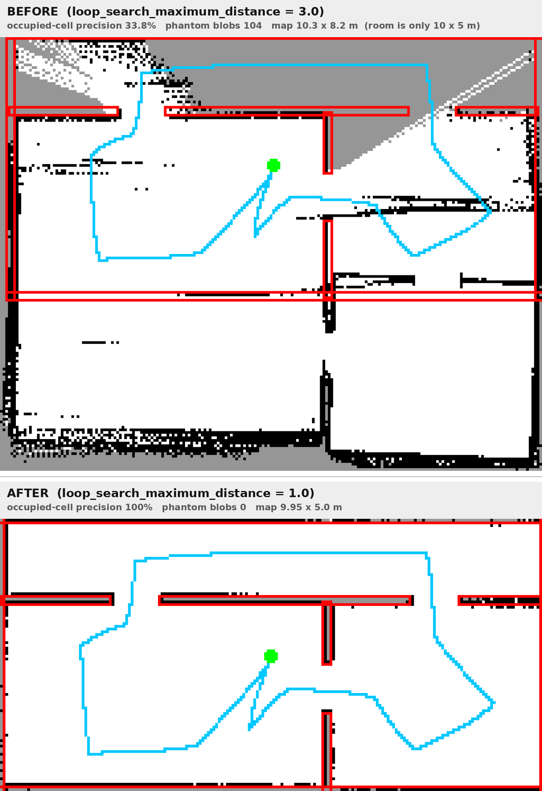

# SLAM 建图（slam_toolbox）

## 怎么跑

```bash
# 一条命令：Gazebo 仿真 + slam_toolbox + RViz（Fixed Frame 已设为 map）
ros2 launch my_robot_description slam.launch.py

# 另开一个终端遥控，边走边看 RViz 里地图长出来
ros2 run teleop_twist_keyboard teleop_twist_keyboard

# 建完保存成 pgm + yaml（给以后的 Nav2 / AMCL 用）
ros2 run nav2_map_server map_saver_cli -f ~/my_map
```

如果 Gazebo 已经在别的终端跑着：`ros2 launch my_robot_description slam.launch.py sim:=false`。

换世界：`world:=rooms.sdf`（默认，两间房+走廊）或 `world:=empty.sdf`（单面墙，雷达回归用）。

## 实测结果

`worlds/rooms.sdf`，闭环路线约 23 m，走完 14 个路点。与解析几何逐格比对：

| 指标 | 数值 |
|---|---|
| 占用格精度（占用格落在真实墙面 15 cm 内） | **100%**（1671/1671） |
| 可见墙面覆盖率 | 88.4%（713/807） |
| 幻影墙 | **0 块** |
| 地图尺寸 | 9.95 × 5.0 m（真值房间 10 × 5 m） |
| 前 45 s 的 SLAM 定位误差 | < 5 cm |

## ⚠️ 两处不改就一定建不出正确地图的配置

这两条都写在 `config/slam_toolbox.yaml` 里对应参数的注释中，这里只讲结论。

### 1. `check_min_dist_and_heading_precisely: true`（默认 false）

`slam_toolbox_common.cpp` 的 `shouldProcessScan()` 里，默认走的是这一支：

```cpp
} else if (dist2 < 0.8 * min_dist2) {   // 只看平移距离
    return false;
}
```

**转角根本不参与判断。** 于是"原地旋转"永远被判成"没动"，扫描一个都不处理：

- 地图冻结（实测：平移 0.8 m → 占用格 +249；原地旋转 6 rad → 占用格 **+0**，栅格逐位相同）
- `map->odom` 恒为 0，里程计的转角偏差永远得不到纠正
- 这台四轮 skid-steer 原地转时 `/odom` 的转角是真值的 **1.37 倍**，累积下来整张地图被拧歪约 20°

改成 `true` 后：`map->odom` 补偿了 −179.77°，纯旋转 500° 的估计残差从 **179.8° → 4.1°**。

上游 issue：[#807](https://github.com/SteveMacenski/slam_toolbox/issues/807)（`minimum_travel_heading` 在 Jazzy 无效）、[#499](https://github.com/SteveMacenski/slam_toolbox/issues/499)（旋转不更新地图）。

### 2. `loop_search_maximum_distance: 1.0`（上游默认 3.0）

3.0 m 在这个 10×5 m 的房间里意味着几乎每个历史节点都是回环候选，于是匹配到错误位置，
位姿图一优化就把当前节点整体挪走——实测在 t=92 s **一次性跳变 3.44 m**，
地图上出现两份重叠的房间。

改成 1.0 m（小于环境里最窄的可区分特征间距）后精度 100%、幻影墙 0，同时保住回环能力。
换到更大的场地可以适当调大，但**不要一上来就用默认的 3.0**。



> 红框 = 真实墙面，青线 = 机器人真值轨迹，黑格 = 建出来的占用格。
> 上图：回环半径 3.0，地图被复制成两份且整体错位。下图：半径 1.0，每条黑墙都压在红墙上。

## 里程计为什么这么差（这不是 bug）

四轮 skid-steer 原地旋转时四个轮子必须横向刮擦，编码器积分出来的转角必然大于车体真实转角。
实测比值 **1.37**（真值转 497.9°，odom 报 681.8°）。这是实车同样存在的固有特性，
仿真里**故意保留**，让 SLAM/Nav2 面对和实车一样的里程计质量。

标定旋钮是 URDF 里的 `wheel_mu_lat`，标定方法见 `real_robot_params.md`。
