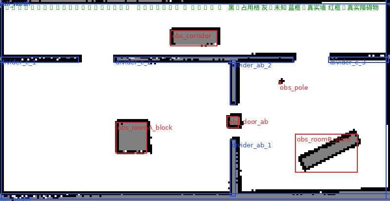

# 工具脚本

五个脚本装在 `lib/my_robot_description/` 下，都可以用 `ros2 run` 调用。
它们原来是调试时写在临时目录里的，后来收进仓库——**这类工具不该放在
`/tmp`**（被系统清过一次，丢了一批）。

```bash
colcon build --symlink-install --packages-select my_robot_description
source install/setup.bash
```

---

## `mapeval.py` —— 建图质量验收

把一张栅格地图和 `worlds/*.sdf` 里的**真实几何**逐格比对，回答"这张图建得
对不对"。每次重新建图（`slam.launch.py` 或 `nav.launch.py slam:=true`）之后
都该跑一次。

```bash
ros2 run my_robot_description mapeval.py src/my_robot_description/maps/rooms.yaml
ros2 run my_robot_description mapeval.py ~/my_map.yaml --world src/my_robot_description/worlds/rooms.sdf
ros2 run my_robot_description mapeval.py ~/my_map.yaml --json      # 机器可读
ros2 run my_robot_description mapeval.py ~/my_map.yaml --no-shift  # 跳过平移搜索，快一些
ros2 run my_robot_description mapeval.py ~/my_map.yaml --png out.png  # 出一张对照图
```

**墙面和门洞是从 SDF 自动解析的**（只认 `<collision>` 里的 `<box>`，
`ground_plane` 那种 `<plane>` 自动忽略），门洞由"同一堵墙上共线两段 box
之间的空隙"推出。所以换 world 不用改这个脚本。

障碍物与结构墙靠**名字前缀**区分：`obs_*` 算障碍物，其余算结构墙。
门洞推导、幻影块判定、对照墙段只用结构墙，而"占用格到最近几何体"的距离用
全部 box（障碍物在图上本来就该有占用格）。
`rooms_obstacles.sdf` 里门AB 正中间塞了柱子，所以那个门洞的占用格要**扣掉
柱子本身**再看——输出里会写成"净 xx 格"。

输出：

| 项目 | 含义 | 合格线 |
|---|---|---|
| 占用格到最近真实墙面 均值/最大 | 地图上的墙有没有画在真实的墙位置上 | 均值 < 2 cm，最大 < 10 cm |
| ≤ 5 cm / ≤ 10 cm 通过率 | 同上，分布视角 | ≤10 cm 必须 100% |
| 幻影墙 | 整块离真实墙 >15 cm 的连通分量 = 凭空多出来的东西 | 0 块 |
| 可见墙面覆盖率 | 真实墙面上有多少比例被画出来 | 越高越好，本场地 78~88% |
| 门洞通畅度 | 门洞里有多少占用格，理想 0 | 净占用 < 25%；同方法量真实墙段是 40~70% |
| 障碍物进图情况 | 每个 `obs_*` 最近的占用格离它多远 / 它的边界被覆盖多少 | 最近距离 ≤ 5 cm |
| 最长墙中段 1 m 覆盖率 | 挑一段确实是墙的地方做对照 | —— |
| 最佳整体平移 | 地图相对 world 的整体偏移 | 应 < 5 cm |

退出码：任何门洞净占用 ≥ 50%、**或任何一个 `obs_*` 障碍物没进图**，就返回 1，
方便脚本化卡关。

障碍物的"边界覆盖率"不会到 100% —— 背对机器人轨迹的那几面雷达本来就看不到。
真正要看的判据是**最近占用格距离**：障碍物进了图，这个值就该 ≈ 0。

`--png` 出的对照图：黑=占用格 灰=未知 蓝框=真实墙 红框=真实障碍物。
红框是**未旋转的 AABB**，所以斜着放的障碍物框会比实体大一圈，那是 AABB 的
固有保守性，不代表地图画错了：



> 画图时踩到：没有哪个字体两边都行。DejaVu 没有中文字形（中文变豆腐块），
> DroidSansFallback 反过来把 ASCII 也画成豆腐块。所以标题和实体名各用一个字体。

**本场地实测参考**（三张图，同一套判据）：

| 地图 | 到墙均值 | ≤ 5 cm | 幻影墙 | 覆盖率 |
|---|---|---|---|---|
| `slam:=true` 边导航边建 | **1.03 cm** | 99.42% | 0 | **86.0%** |
| 手动遥控建 | 1.12 cm | 99.95% | 0 | 87.1% |
| 早期脚本自动建（`maps/rooms.yaml`） | 1.50 cm | 85.70% | 0 | 78.2% |
| `rooms_obstacles` 自动覆盖路线建（`maps/rooms_obstacles.yaml`） | 1.62 cm | 86.37% | 0 | 96.3% |

---

## `nav_goals.py` —— 批量发导航目标并验收

依次下发一串 `NavigateToPose`，每个都打印耗时、终点位姿（TF 查
`map`->`base_link`）和到目标的距离。

```bash
ros2 run my_robot_description nav_goals.py -2.5,0.6 -2.5,1.9 2.5,1.9
ros2 run my_robot_description nav_goals.py --file goals.txt
ros2 run my_robot_description nav_goals.py 3.0,0.3,90 --timeout 90 --json

# 路径点导航：一次 FollowWaypoints 交给 nav2_waypoint_follower
ros2 run my_robot_description nav_goals.py --mode follow_waypoints -2.5,0.6 -2.5,1.9 2.5,1.9
```

★ 负坐标（`-2.5,0.6`）不用加 `--`：argparse 本来会把 `-2.5` 当选项，
而 `ros2 run` 又会把用户写的 `--` 吞掉，所以脚本内部会自己补一个。
补的方式是**把坐标挪到最后**，而不是"插一个 `--` 就完事"——后者会让后面
所有东西都变成位置参数，于是 `nav_goals.py 0.0,0.0 --timeout 200` 里的
`--timeout` 会被当成目标，报 `目标格式应为 x,y[,yaw_deg]，收到 '--timeout'`。

`--mode follow_waypoints` 用的是 `nav2_waypoint_follower`，
`stop_on_failure` 决定某个路点到不了时是跳过继续还是整体失败
（本工程配的是 `false` = 跳过继续）。返回时会列出每个未到达路点及其
`error_code`，见 `docs/acceptance.md`。

★ `MissedWaypoint.error_code` 会带**两套**错误码，看数字的第一位能分开：

| 段 | 来源 | 例子 |
|---|---|---|
| 100~107 | `nav2_msgs/action/FollowPath`（路径算出来了但**走不动**） | `105 FAILED_TO_MAKE_PROGRESS` |
| 200~208 | `nav2_msgs/action/ComputePathToPose`（**算不出**路径） | `208 NO_VALID_PATH` |
| 600/601 | `FollowWaypoints` 自己 | `601 TASK_EXECUTOR_FAILED` |

一开始只列了 200 段，于是实际报出 `error_code=105` 时看不出是什么意思。

* 目标格式 `x,y` 或 `x,y,yaw_deg`（度，0 = +x 方向）
* `--file` 每行一个，`#` 开头和空行忽略
* 查 TF 用的是"最近可用的变换"，所以**不需要** `use_sim_time`
* 全部成功退出码 0，有失败返回 1

`goals.txt` 例子（本场地串起三个门的一条路线）：

```
# x, y[, yaw_deg]
-2.5, 0.6
-2.5, 1.9      # 穿门 A 进走廊
 2.5, 1.9      # 走廊东端
 3.0, 0.3      # 穿门 B 进房间 B
```

---

## `obs_test.py` —— 障碍物避让验收

两种模式：

* **动态模式**（默认）——在**运行时**用 Gazebo 的 `/world/default/create` 服务
  生成一个障碍物，验"地图上没有、雷达突然看到"的场景。
* **静态模式**（`--static`）——障碍物是 world 文件里固有的（`obs_*`），
  不生成也不删除，验"地图上已知的障碍会不会被绕开"。

```bash
# 动态：T1 静态未知障碍物挡在路径正中（一开始就在）
ros2 run my_robot_description obs_test.py --goal=0.0,0.0 --obstacle=-2.0,0.0

# 动态：T2 车开到一半，障碍物在车前 0.7 m 突然出现
ros2 run my_robot_description obs_test.py --goal=-4.0,0.0 --obstacle=-2.0,0.0 --trigger-dist 0.7

# 动态：T5 细杆（验证稀疏点云会不会漏判）
ros2 run my_robot_description obs_test.py --goal=0.0,0.0 --obstacle=-2.0,0.0 --size 0.05

# 静态：走 world 里固有的 5 个障碍物（默认用 rooms_obstacles.sdf）
ros2 run my_robot_description obs_test.py --static --goal=4.2,-1.9

# 动态：不生成障碍物的基线，用于对照
ros2 run my_robot_description obs_test.py --goal=-4.0,0.0
```

★ 参数值以 `-` 开头时必须写成 `--goal=-4.0,0.0` 这种 `=` 形式，
否则 argparse 会把它当成选项。

判读：

| 输出 | 含义 |
|---|---|
| 最小间距 > 27.3 cm | 车体外接圆半径是 27.3 cm，所以**确定没碰上** |
| 最小间距 < 0 | 车心进到障碍物矩形里了 = 撞了 |
| **接触判定** | OBB-OBB 分离轴测试（车体按真实朝向），**结论直接看它** |
| `collision_monitor 介入` | 兜底动作生效（本工程配的是 APPROACH，不是 STOP） |
| 全局代价图致命格 > 0 | 雷达把**地图上不存在**的障碍物标进代价图了 |

★ 判"有没有撞上"必须用**真实旋转矩形**，不能拿 AABB。斜 25° 放的
`obs_roomB_slant`（1.60×0.35）其 AABB 是 1.60×0.99 —— 面积 1.59 m²，
而实体只有 0.56 m²，AABB 的四个角伸出去一大截，机器人从旁边 20 cm 过也会
被判成"撞上了"。第一版就是这么写的，误报了一次。

★ 代价图的坑：`/global_costmap/costmap` 上的代价是**缩放到 0~100** 发布的，
不是 0~255。判据是实测的——地图里已知的墙在这条话题上读到的就是 100。
含义见下面 `cost_slice.py` 一节。

静态模式还额外订阅 `/world/default/dynamic_pose/info` 拿**仿真真值位姿**做
接触判定（动态模式用的是 TF 位姿）。为什么不用 TF：`odom→base_link` 来自
DiffDrive 的轮速积分，原地转时因侧滑，转角是真值的 1.37 倍，拿它判"有没有
撞到"会得出错结论。

> 这个桥接有个坑：`gz.msgs.Pose_V → tf2_msgs/TFMessage` 会**把实体名丢掉**
> （`frame_id` / `child_frame_id` 全是空字符串），所以按名字找不到 `my_robot`，
> 只能按顺序取第一条 —— 那条正是模型的世界位姿，跟在后面的 `base_link` 和
> 4 个轮子是**相对模型**的局部坐标（车动它们也不变，拿来当位姿会得出"车一直
> 没动"）。取错了不会静默出错：报告里的"定位自检"会算出 TF 与真值的偏差，
> 取错的话残差会等于车的总位移。

定位自检把偏差拆成两部分：**系统偏移**（地图坐标系原点由 SLAM 决定，和仿真
世界原点不会严格重合，是常数，不影响导航）和**抖动**（扣掉系统偏移后的残差，
这才是定位质量）。

实测结论（含一条没通过的）见 `docs/acceptance.md`。

---

## `cost_slice.py` —— 看代价图，判断"这条路到底能不能过"

```bash
ros2 run my_robot_description cost_slice.py 4.0,4.95,-2.4,-0.85
ros2 run my_robot_description cost_slice.py -0.3,0.3,1.2,2.45 --topic /global_costmap/static_layer
```

"能不能过"不能只看世界的几何尺寸。规划器看到的是**代价图**：障碍物周围按
`inflation_radius` 铺开一圈代价。两个障碍物之间哪怕物理上留了 0.7 m，如果
两边各铺 0.35 m 膨胀，中间就只剩一条极窄的低代价缝。

代价读数：

| 值 | 含义 |
|---|---|
| 0 | 自由 |
| 1~98 | 膨胀代价（越大越靠近障碍物） |
| **99** | `INSCRIBED_INFLATED_OBSTACLE`：车心在这里，车体就已经压到障碍物了 |
| 100 | `LETHAL_OBSTACLE` |
| -1 | 未知 |

实测（`rooms_obstacles.sdf` 的走廊，障碍物与北墙之间物理上留 0.675 m）：
`0.675 m < 2 × inflation_radius = 0.70 m`，两侧膨胀场**本来就重叠**，
所以**全程没有一格是自由空间**，最便宜的格子也只有 61~99 之间。
结论见 `docs/nav2.md` 的"能过 ≠ 好过"一节。

★ `nav_msgs/OccupancyGrid` 的 `data[0]` 是**左下角**（y 最小），和 pgm 图像
"第 0 行在顶部"相反。按图像习惯算 row 会把整张表上下翻转，看起来就像
"墙画错位置了"（踩过，白查了一轮）。

---

## `xwd2png.py` —— X11 截图转 png

纯调试辅助，跟机器人无关。WSLg 下想把手里的 RViz/Gazebo 窗口存成图片时用：

```bash
export DISPLAY=:0
xwininfo -root -tree | grep -i rviz        # 找到窗口 id，比如 0x600106
xwd -id 0x600106 -out /tmp/shot.xwd
ros2 run my_robot_description xwd2png.py /tmp/shot.xwd shot.png
```

坑：X 服务器的行距经常按 4 字节对齐（`bpl == w*4`），**即使头里写的是
`bpp=24`**。所以脚本按行距判断真实的每像素字节数，而不是信 `bpp`——照
`bpp=24` 解会 `cannot reshape array`。
